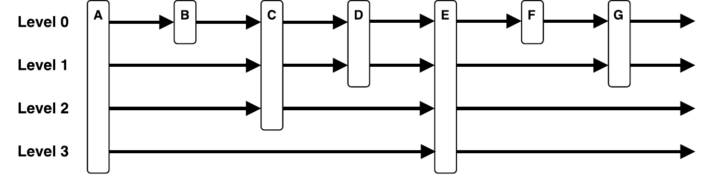
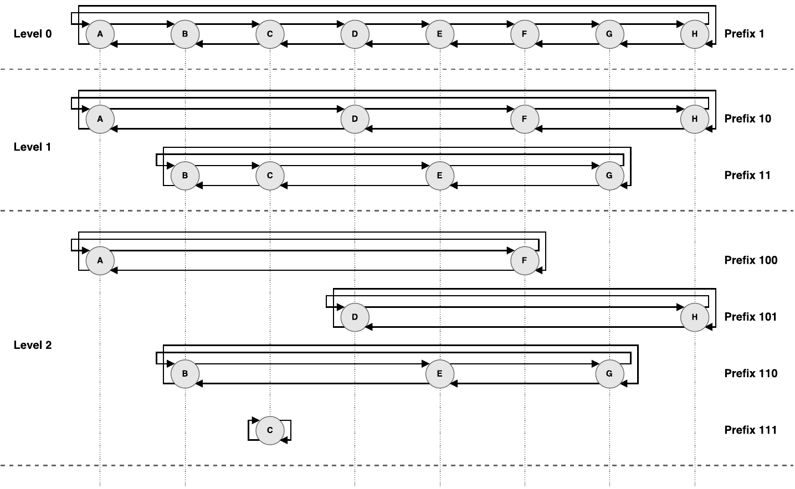
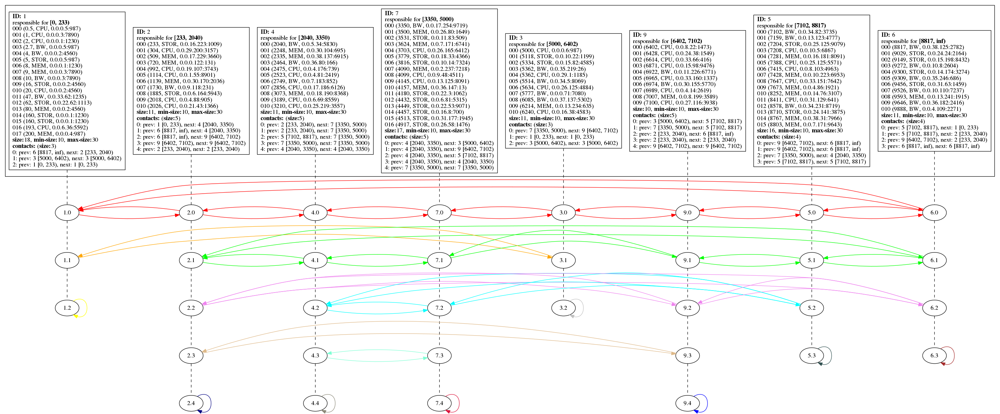

# Skip Graph

A [http://cs-www.cs.yale.edu/homes/shah/pubs/soda2003.pdf](Skip Graph) is a robust, ordered data
structure for distributed self-organizing systems such as peer-to-peer networks.
It allows access in logarithmic time via probabilistic assignment of its nodes to higher order
'shortcut'-levels. A Skip Graph is based on a network of doubly linked, disjoint skip lists.

This Skip Graph-implementation is a sketch for
[https://ieeexplore.ieee.org/document/8064026](PacketSkip), an ordered index structure for efficient
storage and retrieval of capacity-information from network nodes. PacketSkip uses a greedy
algorithm to govern the graph structure without any need for global knowledge.

#### Skip list



#### Skip graph



#### Actual implementation




### Requirements

- Java 8+
- graphviz (e.g.: `sudo apt install graphviz`)

### Compile

```
$ mkdir out
$ javac -d out -sourcepath src src/de/skipgraph/Main.java
```


### Run

```
$ cd out
$ java de.skipgraph.Main
```


### Results

The `main` class adds random capacity values to the Skip Graph and performs search and delete
operations on the graph.
With each insert/leave operation (i.e. add or remove a node to/from the data structure) a dot-file
will be created in the graph/ folder in order to log the state of the skip graph.
